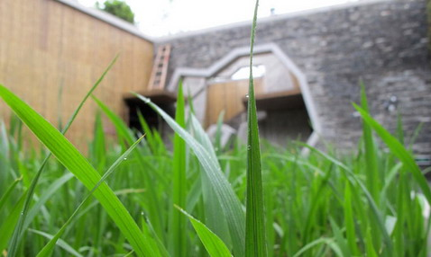

# js图片轮播切换效果淡入淡出Carousel1

效果如下：


all code:
```
<!DOCTYPE html>
<html lang="en">
<head>
    <meta charset="UTF-8"/>
    <title>图片轮播切换效果</title>
    <style>
        #banner {position:relative; width:478px; height:286px; border:1px solid #666; overflow:hidden;margin:0 auto;}
        #banner_list img {border:0px;}
        #banner_bg {position:absolute; bottom:0;background-color:#000;height:30px;filter: Alpha(Opacity=30);opacity:0.3;z-index:1000;cursor:pointer; width:478px; }
        #banner_info{position:absolute; bottom:0; left:5px; line-height:30px;color:#fff;z-index:1001}
        #banner_text {position:absolute;width:120px;z-index:1002; right:3px; bottom:3px;}
        #banner ul {position:absolute;list-style-type:none;filter: Alpha(Opacity=75);opacity:0.75; border:1px solid #fff;z-index:1002;margin:0; padding:0; bottom:3px; right:5px;}
        #banner ul li { padding:0px 8px;float:left;display:block;color:#FFF;border:#fff 1px solid;background-color:#6f4f67;cursor:pointer}
        #banner ul li.on{ background-color:#900}
        #banner_list a{position:absolute;} /*<!-- 让四张图片都可以重叠在一起-->*/
    </style>
</head>
<body>
<div id="banner">	
	<div id="banner_bg"></div>  <!--标题背景-->
	<a href="#" id="banner_info"></a> <!--标题-->
    <ul id="list"></ul>
   <div id="banner_list">
        <a href="#" target="_blank"></a>
        <a href="#" target="_blank"></a>
        <a href="#" target="_blank"></a>
        <a href="#" target="_blank"></a>
	</div>
</div>
</body>
</html>
<script>
    /**************************************************
     * 用法：//count:图片数量，wrapId:包裹图片的DIV,ulId:按
     钮DIV,infoId：信息栏 babyzone.scroll(count,wrapId,ulId,infoId);
     **************************************************/
    var babyzone = function() {
        function id(name) {return document.getElementById(name);}
        //遍历函数

        function each(arr, callback, thisp) {
            if (arr.forEach) {arr.forEach(callback, thisp);}
            else { for (var i = 0, len = arr.length; i < len; i++) callback.call(thisp, arr[i], i, arr);}
        }
        function fadeIn(elem) {
            setOpacity(elem, 0)
            for ( var i = 0; i < 20; i++) {
                (function() {
                    var pos = i * 5;
                    setTimeout(function() {
                        setOpacity(elem, pos)
                    }, i * 25);
                })(i);
            }
        }
        function fadeOut(elem) {
            for ( var i = 0; i <= 20; i++) {
                (function() {
                    var pos = 100 - i * 5;
                    setTimeout(function() {
                        setOpacity(elem, pos)
                    }, i * 25);
                })(i);
            }
        }
        // 设置透明度
        function setOpacity(elem, level) {
            if (elem.filters) {
                elem.style.filter = "alpha(opacity=" + level + ")";
            } else {
                elem.style.opacity = level / 100;
            }
        }
        return {
            //count:图片数量，wrapId:包裹图片的DIV,ulId:按钮DIV,	infoId：信息栏
            scroll : function(count,wrapId,ulId,infoId) {
                var self=this;
                var targetIdx=0;      //目标图片序号
                var curIndex=0;       //现在图片序号
                //添加Li按钮
                var frag=document.createDocumentFragment();
                this.num=[];    //存储各个li的应用，为下面的添加事件做准备
                this.info=id(infoId);
                for(var i=0;i<count;i++){
                    (this.num[i]=frag.appendChild(document.createElement("li"))).innerHTML=i+1;
                }
                id(ulId).appendChild(frag);

                //初始化信息
                this.img = id(wrapId).getElementsByTagName("a");
                this.info.innerHTML=self.img[0].firstChild.title;
                this.num[0].className="on";
                //将除了第一张外的所有图片设置为透明
                each(this.img,function(elem,idx,arr){
                    if (idx!=0) setOpacity(elem,0);
                });

                //为所有的li添加点击事件
                each(this.num,function(elem,idx,arr){
                    elem.onclick=function(){
                        self.fade(idx,curIndex);
                        curIndex=idx;
                        targetIdx=idx;
                    }
                });

                //自动轮播效果
                var itv=setInterval(function(){
                    if(targetIdx<self.num.length-1){
                        targetIdx++;
                    }else{
                        targetIdx=0;
                    }
                    self.fade(targetIdx,curIndex);
                    curIndex=targetIdx;
                },2000);
                id(ulId).onmouseover=function(){ clearInterval(itv)};
                id(ulId).onmouseout=function(){
                    itv=setInterval(function(){
                        if(targetIdx<self.num.length-1){
                            targetIdx++;
                        }else{
                            targetIdx=0;
                        }
                        self.fade(targetIdx,curIndex);
                        curIndex=targetIdx;
                    },2000);
                }
            },
            fade:function(idx,lastIdx){
                if(idx==lastIdx) return;
                var self=this;
                fadeOut(self.img[lastIdx]);
                fadeIn(self.img[idx]);
                each(self.num,function(elem,elemidx,arr){
                    if (elemidx!=idx) {
                        self.num[elemidx].className='';
                    }else{
                        id("list").style.background="";
                        self.num[elemidx].className='on';
                    }
                });
                this.info.innerHTML=self.img[idx].firstChild.title;
            }
        }
    }();
    babyzone.scroll(4,"banner_list","list","banner_info");
</script>

```

